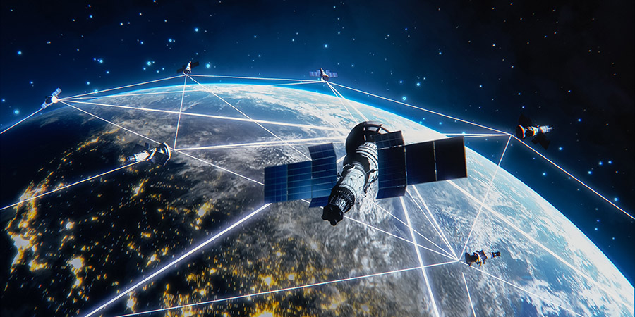

<p align="center">
  
</p>

<h1 align="center">🚀 Smart Satellite Queue Manager</h1>
<p align="center">
  <b>AI-powered queue management system for satellite-ground station communications</b>
</p>

---

## ✨ Overview
The **Smart Satellite Queue Manager** is a next-generation scheduling system for managing satellite–ground station communications.  
It combines **machine learning**, **orbital mechanics**, and a **dynamic admin console** to provide efficient and fair satellite scheduling.

---

## 🔥 Features
- 🤖 AI-based priority calculation for satellite requests  
- 🌍 Orbital mechanics integration for visibility prediction  
- 🛰️ Multiple satellite queues (LEO, MEO, GEO) with merging  
- ⚙️ Admin console for real-time priority adjustment  
- 📊 Fairness monitoring & advanced reporting  

---

## 📂 Project Structure

📦 smart-satellite-queue-manager  
 ┣ 📜 main.cpp                          # Entry point of the system  
 ┣ 📜 admin_console.h                   # Admin interface for priority control  
 ┣ 📜 constants.h                       # Constants and configuration values  
 ┣ 📜 hash_table.h                      # Custom hash table for fast access  
 ┣ 📜 orbital_mechanics.h               # Orbital mechanics calculations  
 ┣ 📜 satellite.h                       # Satellite object definition  
 ┣ 📜 satellite_queue.h                 # Queue implementation for satellites  
 ┗ 📜 professional_gui_fixed.cpp        # GUI prototype / fixed interface  

---

## ⚡ Installation & Usage
```bash
# Clone the repository
git clone https://github.com/mazen-elbaz/smart-satellite-queue-manager.git
cd smart-satellite-queue-manager

# Compile the project
g++ -std=c++17 -o satellite_manager main.cpp

# Run
./satellite_manager
